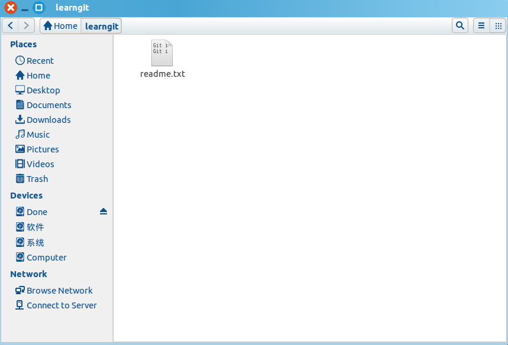

[TOC]
* * *
February 19, 2018 12:50 PM

##gcc -Wall选项
选项-Wall开启编译器几乎所有常用的警告——**强烈建议使用该选项**。
编译器有很多其他警告选项，但-Wall是最常用的。默认情况下GCC不会产生任何警告信息。当编写C或C++程序时编译器警告非常有助于检测程序存在的问题。

##gcc -lm选项
如果有用到math.h库等非gcc默认调用的标准库，请使用-lm参数

##gcc -g选项
选项-g表示在生成的目标文件中带调试信息

##\#include"FILE.H"和\#include&lt;FILE.H&gt;
语句#include "FILE.h"与#include &lt;FILE.h&gt;有所不同：前者在搜索系统头文件目录之前将先在当前目录中搜索文件‘FILE.h’，后者只搜索系统头文件而不查看当前目录。

* * *
February 20, 2018 8:55 AM
##做算法题建议
**不要总是想着去优化，先把代码实现了再说，哪怕用最笨的方法。**
因为现代计算机计算能力已经很强了，哪怕你写的代码复杂度相当高，程序也不会运行太长时间.
* * *
February 22, 2018 11:34 AM
##算法题中输入、输出样例的作用
* 明确规定输入输出格式
* 给出一组或者几组测试数据和预期运行结果，方便验证自己程序的正确与否

##算法题做对几要素
* 正确接收规定格式的输入
* 正确地对输入数据进行处理
* 正确按规定格式输出结果

##算法题易错点
* 死循环
* 输入、输出格式错误

##算法模板：判断一个数是否为素数
``` cpp
#include <math.h>
#include <cstdio>

bool is_prime(int n){
	for(int i=2;i <= int(sqrt(n));i++)
		if(n%i==0)
    		return false;
	return true;
}
```

##算法题解题步骤
* **起名字：**给输入数据起名字，此时并不写代码，只是起名字，不去构思数据输入部分的代码
1.对字符型输入数据能按字符进行访问
2.对字符串型输入数据能分别按串、字符访问
3.对整型数据能按变量名访问
* **写算法：**构思算法以满足题目需要（重点）
* **敲代码**
1.写输入、输出部分的代码，此时不求空间开辟最小，只求正确处理输入、输出数据
2.写中间部分算法代码
* **调程序：**调试程序使得代码正确
* **优化**

##Ubuntu14.04耳机没有声音，状态：已解决
* 控制台键入`alsamixer`，寻找headphone选项，并通过shift+m开启
* 保存设置，控制台键入`sudo alsactl store`

* * *
February 23, 2018 9:50 AM
##sort(first,last,cmp)
排序范围是`[first,last)`,注意**前开后闭区间**

* * *
February 24, 2018 8:54 AM
##git学习笔记
###安装git
####在Ubuntu14.04上安装git
在终端输入`git`命令,看系统有没有安装git
本系统已安装,所以不再安装,若未安装,运行`sudo apt-get install git`安装git
安装成功后,终端输入`git --version`查看已安装git的版本

###创建版本库
####导言
**版本库**又名**仓库**,英文名**repository**,可以简单理解为一个目录,这个目录里面的所有文件都可以被git管理,每个文件的修改,删除,git都能跟踪,以便任何时候都可以追踪历史,或者在将来某个时刻可以还原.
####创建一个空目录
```bash
$ mkdir learngit
$ cd learngit
$ pwd
/home/andrew/learngit
```
####使用`git init`把这个目录变成git可以管理的仓库
```bash
$ git init
Initialized empty Git repository in /home/andrew/learngit/.git/
```
####把文件添加到版本库
**注意:**所有的版本控制系统只能跟踪文本文件(txt文本文件,网页文件,所有的程序源代码等等文本文件),git也是如此.版本控制系统可以告诉你每次的改动,比如在第5行加了一个单词"Linux",在第8行删除了一个单词"Windows".而对于图片,视频这些二进制文件,git可以进行版本控制,但是没办法跟踪文件的细节变化,只能吧二进制文件每次的改动穿起来,也就是知道图片从100KB改成了120KB,具体做了啥,版本控制系统不知道,也没法知道.MS的Word文档是二进制文件,Windows操作系统自带的文本编辑器编辑的文本文档在开头会被默认添加0xefbbbf,这样会造成很多意想不到问题,建议Windows下编辑文本文档使用Notepad\+\+代替记事本,记得把Notepad\+\+的默认编码设置为`UTF-8 without BOM`即可
**强烈建议所有文件使用统一的标准UTF-8编码**
#####编写文件
现在我们编写一个`readme.txt`的文件,内容如下
```txt
Git is a version control system.
Git is free software.
```
注意一定要将该文件放到`learngit`目录下(子目录也行),因为这是一个git仓库,放到其他地方git找不到这个文件.
#####用命令`git add`告诉git,把文件添加到git仓库
```bash
$ git add readme.txt
```
执行上边这个命令,没有任何显示,这就对了,Unix的哲学`没有消息就是好消息`,说明添加成功.
#####用命令`git commit`告诉git,把文件提交到仓库
```bash
$ git commit -m "wrote a readme file"
*** Please tell me who you are.
Run
  git config --global user.email "you@example.com"
  git config --global user.name "Your Name"
to set your account`s default identity.
Omit --global to set the identity only in this repository.
fatal: unable to auto-detect email address (got 'andrew@andrew-X550CC.(none)')
$ git config --global user.name "Andrew"
$ git config --global user.email "270280585@qq.com"
$ git commit -m "wrote a readme file"
[master (root-commit) 24a5b7e] wrote a readme file
 1 file changed, 2 insertions(+)
 create mode 100644 readme.txt
```
简单解释一些`git commit`命令,`-m`后面输入的是本次提交的说明,可以输入任意内容,当然最好是有意义的,就是写你这次commit操作都提交了什么文件,或者你对哪些文件做了哪些改动等等.
`git commit`命令执行成功后会告诉你,1个文件背改动(我们新添加的readme.txt文件),插入了两行内容(readme.txt有两行内容)
#####释疑
为什么git添加文件需要`add`,`commit`一共两步呢?因为`commit`可以一次提交很多文件,所以你可以多次`add`不同的文件,比如:
```bash
$ git add file1.txt
$ git add file2.txt file3.txt
$ git commit -m "add 3 files."
```
####小结
初始化一个git仓库,使用`git init`命令
添加文件到git仓库,分两步:
* 第一步,使用命令`git add *filename*`,注意,可反复多次使用,添加多个文件;
* 第二步,使用命令`git commit`,完成.

###时光机穿梭
####导言
我们已经成功地添加并提交了一个readme.txt文件,现在,是时候继续工作了,于是,我们继续修改readme.txt文件,改成如下内容
```txt
Git is a distributed version control system.
Git is free software.
```
现在运行`git status`命令查看结果
```bash
$ git status
On branch master
Changes not staged for commit:
  (use "git add <file>..." to update what will be committed)
  (use "git checkout -- <file>..." to discard changes in working directory)
   modified:   readme.txt
no changes added to commit (use "git add" and/or "git commit -a")
```
`git status`命令可以让我们掌握仓库当前的状态,上面的命令告诉我们,readme.txt被修改过了,但还没有准备提交的修改.
虽然git告诉我们readme.txt被修改了,但如果能看看具体修改了什么内容,自然是极好的.比如你休假两周从国外回来,第一天上班时,已经记不清上次怎么修改的readme.txt,所以,需要用`git diff`命令看看
```bash
$ git diff readme.txt
diff --git a/readme.txt b/readme.txt
index 46d49bf..9247db6 100644
--- a/readme.txt
+++ b/readme.txt
@@ -1,2 +1,2 @@
-Git is a version control system.
+Git is a distributed version control system.
 Git is free software.
```
`git diff`顾名思义就是查看difference,显示的格式正式Unix通用的diff格式,可以从上面的命令输出可以看出,我们在第一行添加了一个"distributed"单词.
知道对readme.txt做了什么修改之后,再把它提交到仓库就放心多了,提交修改和提交新文件是一样的两步,第一步是`git add`
```bash
$ git add readme.txt
```
同样没有任何输出.在执行第二步`git commit`之前,我们再运行`git status`看看当前仓库的状态
```bash
$ git status 
On branch master
Changes to be committed:
  (use "git reset HEAD <file>..." to unstage)

	modified:   readme.txt

```
`git status`告诉我们,将要被提交的修改包括readme.txt,下一步,就可以放心地提交了
```bash
$ git commit -m "add distributed"
[master 76ad318] add distributed
 1 file changed, 1 insertion(+), 1 deletion(-)
```
提交后,我们再用`git status`命令看看仓库的当前状态
```bash
$ git status
On branch master
nothing to commit, working directory clean
```
git告诉我们当前没有需要提交的修改,而且,工作目录是干净(working directory clean)的.
#####小结
* 要随时掌握工作区的状态,使用`git status`命令.
* 如果`git status`告诉你有文件被修改过,用`git diff`可以查看修改内容.

####版本回退
复习上次的命令
```bash
$ git add readme.txt 
$ git commit -m "append GPL"
[master 8809715] append GPL
 1 file changed, 1 insertion(+), 1 deletion(-)
```
现在,我们回顾一下readme.txt文件一共有几个版本被提交到git仓库里了,我们使用`git log`命令查看
```bash
$ git log 
commit 8809715d08323519b1c806c31237c37f360a8204
Author: Andrew <270280585@qq.com>
Date:   Sun Feb 25 00:04:19 2018 +0800

    append GPL

commit 76ad3183585c8e69e1428ae45af7c02ffe7a7bce
Author: Andrew <270280585@qq.com>
Date:   Sat Feb 24 16:48:27 2018 +0800

    add distributed

commit 24a5b7e0a14f30c506fbb47ac432e898d0d73ad6
Author: Andrew <270280585@qq.com>
Date:   Sat Feb 24 11:56:15 2018 +0800

    wrote a readme file
```
`git log`命令显示从最近到最远的提交日志,我们可以看到3次提交,最近的一次是`append GPL`,上一次是`add distributed`,最早的一次是`wrote a readme file`.
如果嫌输出的信息太多,可以试试加上`--pretty=oneline`参数
```bash
$ git log --pretty=oneline 
8809715d08323519b1c806c31237c37f360a8204 append GPL
76ad3183585c8e69e1428ae45af7c02ffe7a7bce add distributed
24a5b7e0a14f30c506fbb47ac432e898d0d73ad6 wrote a readme file
```
需要友情提示的是,你看到的一大串类似`8809715...60a8204`的是`commit id`(版本号),和SVN一样,git的`commit id`不是1,2,3,......递增的数字,而是一个SHA1计算出来的一个非常大的数字,用十六进制表示,而且你看到的`commit id`和我的肯定不一样,以你自己的为准.为什么`commit id`需要用这么一大串数字表示呢?因为git是分布式的版本控制系统,后面我们还要研究多人在同一个版本库里工作,如果大家都用1,2,3,......作为版本号,那肯定就冲突了
好了,现在我们启动时光穿梭机,准备把readme.txt回退到上一个版本,也就是"add distributed"的哪个版本,怎么做呢?
首先,git必须知道当前版本是哪个版本,在git中,用`HEAD`表示当前版本,也就是最新的提交`8809715...60a8204`(注意我的提交ID和你的肯定不一样),上一个版本就是`HEAD^`,上上一个就是`HEAD^^`,当然往上100个版本写100个`^`比较容易数不过来,所以写成`HEAD~100`.
现在我们吧当前版本"append GPL"回退到上一个版本"add distributed",就可以使用`git reset`命令
```bash
$ git reset --hard HEAD^
HEAD is now at 76ad318 add distributed
```
`--HARD`参数有啥意义?这个后面讲,现在你先放心使用
看看readme.txt内容是不是版本`add distributed`
```bash
$ cat readme.txt 
Git is a distributed version control system.
Git is free software.
```
果然
还可以继续回退到上一个版本`wrote a readme file`,不过且慢,我们用`git log`再看看现在版本库的状态
```bash
$ git log
commit 76ad3183585c8e69e1428ae45af7c02ffe7a7bce
Author: Andrew <270280585@qq.com>
Date:   Sat Feb 24 16:48:27 2018 +0800

    add distributed

commit 24a5b7e0a14f30c506fbb47ac432e898d0d73ad6
Author: Andrew <270280585@qq.com>
Date:   Sat Feb 24 11:56:15 2018 +0800

    wrote a readme file
```
最新的哪个版本`append GPL`已经看不到了,好比你从21世纪做时光机来到了19实际,想再回去已经回不去了,肿么办?
办法其实还是有的,只要上面的命令行窗口还没有被关掉,你就可以顺着网上找啊找啊,找到哪个`append GPL`的`commit id`是`8809715......`,于是就可以制定回到未来的某个版本:
```bash
$ git reset --hard 8809715
HEAD is now at 8809715 append GPL
```
版本号没必要写全,前几位就可以,git会自动去找.当然也不能只写前一两位,因为git可能会找到多个版本号,就无法确定是哪个了
再看看readme.txt的内容
```bash
$ cat readme.txt 
Git is a distributed version control system.
Git is free software distributed under the GPL.
```
果然,我胡汉三又回来了.
现在,你回退到了某个版本,关掉了电脑,第二天早上就后悔了,想恢复到新版本怎么办?找不到新版本的`commit id`怎么办?
在git中,总是有后悔药可以吃的.当你用`$ git reset --hard HEAD^`回退到`add distributed`版本时,在想恢复到`append GPL`,就必须找到`append GPL`的`commit id`.git提供了一个命令`git reflog`用来记录你的每一次命令
```bash
$ git reflog 
8809715 HEAD@{0}: reset: moving to 8809715
76ad318 HEAD@{1}: reset: moving to HEAD^
8809715 HEAD@{2}: commit: append GPL
76ad318 HEAD@{3}: commit: add distributed
24a5b7e HEAD@{4}: reset: moving to 24a5b7e
147aa7e HEAD@{5}: commit: add file test.txt
0f34ebe HEAD@{6}: commit: remove test.txt
22be7e2 HEAD@{7}: commit: add test.txt
5473bf0 HEAD@{8}: commit: git tracks changes
0b264e8 HEAD@{9}: commit: git tracks changes
c6147d5 HEAD@{10}: commit: understand how stage works
8b5370f HEAD@{11}: reset: moving to 8b5370f
871ae61 HEAD@{12}: reset: moving to HEAD^
8b5370f HEAD@{13}: commit: append GPL
871ae61 HEAD@{14}: commit: add a
0cedee2 HEAD@{15}: commit: add distributed
24a5b7e HEAD@{16}: commit (initial): wrote a readme file
```
终于舒了一口气,第三行显示的`append GPL`的`commit id`是`8809715`,现在,你又可以乘坐是关机回到未来了.
#####小结
* `HEAD`指向的版本就是当前版本,因此,git允许我们在版本的历史之间穿梭,使用命令`git reset --hard commit_id`
* 穿梭前,用`git log`可以查看提交历史,以便确定要回退到哪个版本
* 要重返未来,用`git reflog`查看命令历史,以便确定要回到未来的哪个版本

####工作区和暂存区
git和其他版本控制系统如SVN的一个不同之处就是有一个**暂存区**的概念
#####工作区(Working Directory)
就是在你电脑里能看到的目录,比如我的`learngit`文件夹就是一个工作区:

#####版本库(Repository)
工作区有一个隐藏目录`.git`,这个不算工作区,而是git的版本库
git的版本库里存了很多东西,其中最重要的就是称为stage(或者叫index)的暂存区,还有git为我们自动创建的第一个分支`master`,以及指向`master`的一个指针叫`HEAD`.

分之(branch)和`HEAD`的概念我们以后再讲
前面讲了我们把文件网git版本库里添加的时候,是分两步执行的:
* 第一步使用`git add`把文件添加进去,实际上就是把文件修改添加到暂存区;
* 第二步是用`git commit`提交修改,实际上就是吧暂存区的所有内容提交到当前分支.

因为我们创建git版本库时,git自动为我们创建了唯一一个`master`分支,所以现在,`git commit`就是往`master`分支上提交更改.
你可以简单理解为,需要提交的文件修改统统放到暂存区,然后,一次性提交暂存区的所有修改
俗话说,实践出真知.现在,我们再练习一遍,先对`readme.txt`做个修改,比如加上一行内容
```txt
Git is a distributed version control system.
Git is free software distributed under the GPL.
Git has a mutable index called stage.
```

然后在工作区新增一个`LICENCE`文本文件(内容随便写).

```bash
$ cat LICENSE
This is a testing file,meaning nothing.
```

先用`git status`查看一下状态:
```bash
$ git status 
On branch master
Changes not staged for commit:
  (use "git add <file>..." to update what will be committed)
  (use "git checkout -- <file>..." to discard changes in working directory)

	modified:   readme.txt

Untracked files:
  (use "git add <file>..." to include in what will be committed)

	LICENSE

no changes added to commit (use "git add" and/or "git commit -a")
```

git非常清楚地告诉我们,readme.txt被修改了,而LICENSE还从来没有被添加过,所以他的状态是`Untracked`.
现在,使用两次命令`git add`,把`readme.txt`和`LICENSE`都添加后,用`git status`再查看一下:

```bash
$ git status
On branch master
Changes to be committed:
  (use "git reset HEAD <file>..." to unstage)

	new file:   LICENSE
	modified:   readme.txt

```
现在,暂存区的状态就变成这样了

所以,`git add`命令实际上是把要提交的所有修改放到暂存区(Stage),然后,执行`git commit`就可以一次性把暂存区的所有修改提交到分支.
```bash
$ git commit -m "understand how stage works"
[master 7108fec] understand how stage works
 2 files changed, 2 insertions(+)
 create mode 100644 LICENSE
```

一旦提交后,如果你又没有对工作区做任何修改,那么工作区就是"干净的":
```bash
$ git status 
On branch master
nothing to commit, working directory clean
```

现在版本库变成了这样,暂存区就没有任何内容了


#####小结
暂存区是git非常重要的概念,弄明白了暂存区,就弄明白了git的很多操作到底干了什么

####管理修改
现在,假定你已经完全掌握了暂存区的概念.下面,我们要讨论的就是,为什么git比其他版本控制系统设计得优秀,因为git跟踪并管理的是修改,而非文件.
你会问,什么是修改?比如你新增了一行,这就是一个修改;删除了一行,也是一个修改;更改了某些字符,也是一个修改,删了一些又加了一些,也是一个修改;甚至创建一个新文件,也算是一个修改.
为什么说git管理的是修改,而不是文件呢 ?我们还是做实验.第一步,对readme.txt做一个修改,比如加一行内容:
```bash
$ cat readme.txt 
Git is a distributed version control system.
Git is free software distributed under the GPL.
Git has a mutable index called stage.
Git tracks changes.
```

然后,添加:
```bash
$ git add readme.txt 
$ git status 
On branch master
Changes to be committed:
  (use "git reset HEAD <file>..." to unstage)

	modified:   readme.txt
```

然后再修改readme.txt
```bash
$ cat readme.txt 
Git is a distributed version control system.
Git is free software distributed under the GPL.
Git has a mutable index called stage.
Git tracks changes of files.
```

提交:
```bash
$ git commit -m "git tracks changes"
[master bc74198] git tracks changes
 1 file changed, 1 insertion(+)
```

提交后,再看看状态:
```bash
$ git status 
On branch master
Changes not staged for commit:
  (use "git add <file>..." to update what will be committed)
  (use "git checkout -- <file>..." to discard changes in working directory)

	modified:   readme.txt

no changes added to commit (use "git add" and/or "git commit -a")
```

咦,怎么回事,怎么第二次的修改没有被提交?
别激动,我们回顾一下操作过程:
第一次修改->`git add`->第二次修改->`git commit`
你看我们前面讲了,git管理的是修改,当你用`git add`命令后,在工作区的第一次修改被放入暂存区,准备提交,但是,在工作区的第二次修改并没有放入暂存区,所以`git commit`只负责步暂存区的修改提交了,也就是第一次的修改被提交了,第二次的修改不会被提交.
提交后,用`git different HEAD -- readme.txt`命令可以查看工作区和版本库里面最新版本的区别:
```bash
$ git diff HEAD -- readme.txt
diff --git a/readme.txt b/readme.txt
index 76d770f..a9c5755 100644
--- a/readme.txt
+++ b/readme.txt
@@ -1,4 +1,4 @@
 Git is a distributed version control system.
 Git is free software distributed under the GPL.
 Git has a mutable index called stage.
-Git tracks changes.
+Git tracks changes of files.
```

可见,第二次修改确实没有被提交.
那怎么提交第二次修改呢?呢可以继续`git add`再`git commit`,也可以别着急提交提一次修改,先`git add`第二次修改,在`git commit`,就相当于把两次修改合并后一块提交了:
第一次修改->`git add`->第二次修改->`git add`->`git commit`
好,现在,把第二次修改提交了,然后开始小结

#####小结
现在你又理解了git是如何跟踪修改的,每次修改,如果不add到暂存区,那就不会加入到`commit`中.

####撤销修改
自然,你是不会犯错的.不过现在是凌晨两点,你正在赶一份工作报告,你在`readme.txt`中添加了一行:
```bash
$ cat readme.txt 
Git is a distributed version control system.
Git is free software distributed under the GPL.
Git has a mutable index called stage.
Git tracks changes of files.
My stupid boss still prefers SVN.
```

在你准备提交前,一杯咖啡起了作用,你猛然发现了"stupid boss"可能会让你丢掉这个月的奖金!
既然错误发现的及时,就可以很容易地纠正它.你可以删掉最后一行,手动把文件恢复到上一个版本的状态.如果用`git status`查看一下:
```bash
$ git status 
On branch master
Changes not staged for commit:
  (use "git add <file>..." to update what will be committed)
  (use "git checkout -- <file>..." to discard changes in working directory)

	modified:   readme.txt

no changes added to commit (use "git add" and/or "git commit -a")
```
你可以发现,git会告诉你,`git checkout -- file`可以丢弃工作区的修改:
```bash
$ git checkout -- readme.txt
```
命令`git checkout -- readme.txt`意思就是,把readme.txt文件在工作区里的修改全部撤销,这里有两种情况:
* 一种是`readme.txt`自修改后还没有被放到暂存区,现在,撤销修改就回到和版本库一模一样的状态;
* 一种是`readme.txt`已经添加到暂存区后,又做了修改,现在,撤销修改就回到添加到暂存区后的状态.

总之,就是让这个文件回到最近一次`git commit`或`git add`时的状态.
现在,看看`readme.txt`的文件内容
```bash
$ cat readme.txt 
Git is a distributed version control system.
Git is free software distributed under the GPL.
Git has a mutable index called stage.
Git tracks changes of files.
```
文件果然复原了.
`git checkout -- file`命令中的`--`很重要,没有`--`,就变成了"切换到另一个分支"的命令,我们在后面的分支管理中会再次遇到`git checkout`命令.
现在假定是凌晨3点,你不但写了一些胡话,还`git add`到暂存区了:
```bash
$ cat readme.txt 
Git is a distributed version control system.
Git is free software distributed under the GPL.
Git has a mutable index called stage.
Git tracks changes of files.
My stupid boss still prefers SVN.

$ git add readme.txt
```
庆幸的是,在`commit`之前,你发现了这个问题.用`git status`查看一下,修改只是添加到了暂存区,还没有提交:
```bash
$ git status 
On branch master
Changes to be committed:
  (use "git reset HEAD <file>..." to unstage)

	modified:   readme.txt
```
git同样告诉我们,用命令`git reset HEAD file`可以把暂存区的修改撤销掉(unstage),重新放回工作区:
```bash
$ git reset HEAD readme.txt
Unstaged changes after reset:
M	readme.txt
```
`git reset`命令既可以回退版本,也可以把暂存区的修改回退到工作区.当我们用`HEAD`时,表示最新的版本.
再用`git status`查看一下,现在暂存区是干净的,工作区有修改:
```bash
$ git status 
On branch master
Changes not staged for commit:
  (use "git add <file>..." to update what will be committed)
  (use "git checkout -- <file>..." to discard changes in working directory)

	modified:   readme.txt

no changes added to commit (use "git add" and/or "git commit -a")
```
还记得如何丢弃工作区的修改吗?
```bash
$ git checkout -- readme.txt
$ git status 
On branch master
nothing to commit, working directory clean
```
整个世界终于清净了!
现在,假设你不但改错了东西,还从暂存区提交到了版本库,怎么办呢?还记得版本回退一节吗?可以回退到上一个版本.不过,这是有条件的,就是你还没有把自己的本地版本库推送到远程.还记得git是分布式版本控制系统吗?我们后面会讲到远程版本库,一旦你把"stupid boss"提交推送到远程版本库,你就真的惨了......
#####小结
* 场景1:当你改乱了工作区某个文件的内容,想直接丢弃工作区的修改时,用命令`git checkout -- file`.
* 场景2:当你不但改乱了工作区某个文件的内容,还添加到了暂存区时,想丢弃修改,分两步,第一步用命令`git reset HEAD file`,就回到了场景1,第二步按场景1操作.
* 已经提交了不合适的修改到版本库,想要撤销本次提交,参考版本回退一节,不过前提是没有推送到远程库.


